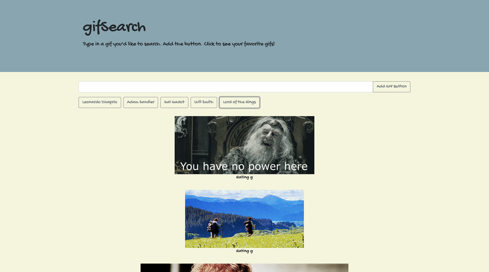

# GifSearch

## Overview

Simple application demonstrating the use of an AJAX request to the Giphy API and jQuery to dynamicaly create elements. Input a gif you would like to see, create a button for that gif, click the button to see the related gifs!

## Built Using

- HTML
- CSS
- jQuery
- Giphy API
- AJAX

